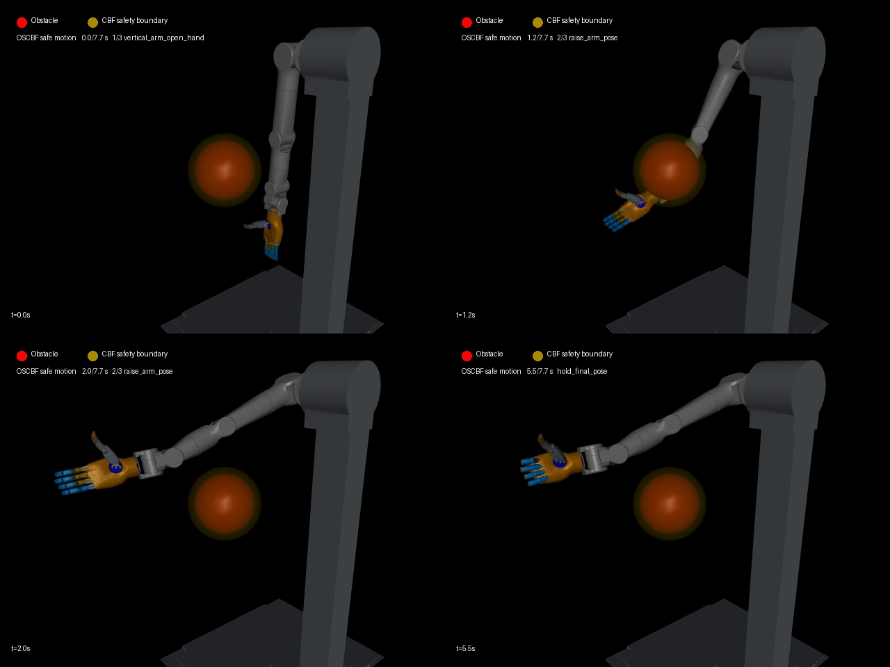
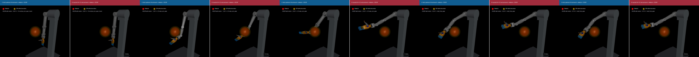

# A7V2 机械臂与灵巧手：竖大拇指及 OSCBF 避障

本文件夹整理了台架、A7V2 七轴机械臂和 L20Lite 右手的点赞动作，以及在同一动作上加入 OSCBF 安全过滤、障碍物避让和 A4 关节限位的实验。包含运行代码、所需 URDF/STL、轨迹 CSV、实验结果、演示视频和汇报材料。

## 视频展示

点击视频链接或下方预览图查看 MP4。下载仓库后，也可打开 [视频展示页](showcase.html) 连续查看全部演示；GitHub 文件页不会直接执行该 HTML。

| 演示 | 内容 | 视频 |
| --- | --- | --- |
| 竖大拇指 | 抬臂、四指弯曲、拇指展开 | [点赞动作](thumbsup/outputs/thumbs_up_arm_hand_stand.mp4) |
| 原始动作，同视角 | 便于与早期避障视频比较 | [原始动作](oscbf/outputs/oscbf_thumbsup/original_thumbsup_same_view.mp4) |
| OSCBF 避障 | 早期 7.7 秒实验，安全过滤后绕开球形障碍物 | [避障演示](oscbf/outputs/oscbf_thumbsup/oscbf_obstacle_avoidance.mp4) |
| 关节限位对比 | 将障碍物移远，单独观察合法/越界 A4 指令的响应 | [限位对比](oscbf/outputs/joint_limit_comparison/a4_joint_limit_comparison.mp4) |
| 避障与限位同时启用 | 相同场景下比较合法 A4 与注入 −0.5 rad 的上游指令 | [同步左右对比](oscbf/outputs/a4_joint_limit_comparison/a4_limit_side_by_side_comparison.mp4) |
| 综合展示 | 左：移除障碍物的未过滤越界动作；右：早期 OSCBF 避障动作 | [综合演示](oscbf/outputs/a4_joint_limit_comparison/no_obstacle_unsafe_vs_original_obstacle.mp4) |

[](oscbf/outputs/oscbf_thumbsup/oscbf_obstacle_avoidance.mp4)

[](oscbf/outputs/a4_joint_limit_comparison/a4_limit_side_by_side_comparison.mp4)

综合展示的两侧场景不同，用于说明动作效果；需要分析限位作用时，请使用同条件的“避障与限位同时启用”实验数据。

## 文件结构

```text
thumbs_up_oscbf/
├── README.md / showcase.html        说明与视频展示
├── requirements.txt                本次验证环境的依赖版本
├── models/a7v2_arm_hand/            实验对应的组合 URDF 和全部引用网格
├── thumbsup/
│   ├── scripts/                    点赞动作、轨迹导出、视频录制
│   └── outputs/                    当前轨迹、动作说明、点赞视频
├── oscbf/
│   ├── run_oscbf_trajectory.py      速度级 OSCBF 控制器与避障回放
│   ├── run_joint_limit_comparison.py 仅关节限位对比
│   ├── run_a4_limit_comparison.py   避障与 A4 限位对比
│   ├── validate_*.py               已有数据与视频校验脚本
│   ├── make_*.py / combine_*.py     结果图与视频处理
│   └── outputs/                    CSV、JSON、图表、MP4、单页 HTML
└── docs/                           学习总结、方法解析和汇报 PPT
```

该目录使用实验时的组合模型快照，脚本通过自身位置解析资源路径。仓库其他模型目录可以继续独立维护。

## 运行

本次验证环境：Windows、Python 3.14.4。其他平台未做运行验证；无显示服务器时，MuJoCo 视频渲染需要可用的 OpenGL 后端。

在本目录安装依赖：

```bash
python -m pip install -r requirements.txt
```

1. 查看点赞动作，或无界面检查动作：

```bash
python thumbsup/scripts/thumbs_up_from_urdf.py
python thumbsup/scripts/thumbs_up_from_urdf.py --no-viewer --fast --print-pose-check
```

2. 导出当前点赞轨迹、重新录制点赞视频：

```bash
python thumbsup/scripts/export_thumbs_up_trajectory.py
python thumbsup/scripts/record_thumbs_up_video.py
```

3. 使用当前轨迹运行避障。下面使用独立输出目录，保留已归档的早期结果：

```bash
python oscbf/run_oscbf_trajectory.py --output-dir outputs_local/current_oscbf
python oscbf/run_oscbf_trajectory.py --output-dir outputs_local/current_oscbf --viewer
python oscbf/run_oscbf_trajectory.py --output-dir outputs_local/current_oscbf --record-video outputs_local/current_oscbf/demo.mp4
```

主程序支持 `--urdf`、`--trajectory`、`--obstacle x y z`、`--obstacle-radius`、`--safety-margin` 等参数，完整选项见 `--help`。

4. 重做关节限位对比实验（会更新对应 `oscbf/outputs/` 子目录）：

```bash
python oscbf/run_joint_limit_comparison.py
python oscbf/run_a4_limit_comparison.py
```

5. 校验归档结果与视频：

```bash
python oscbf/validate_original_video.py
python oscbf/validate_joint_limit_comparison.py
python oscbf/validate_a4_limit_comparison.py
```

## 实验版本与结果

| 数据目录 | 上游轨迹 | 用途 |
| --- | --- | --- |
| `thumbsup/outputs/` | 当前 6.7 秒、A4 = 0 rad 的点赞轨迹 | 默认运行输入 |
| `oscbf/outputs/oscbf_thumbsup/` | 早期 7.7 秒、包含 A4 负角度命令 | 首次未过滤/OSCBF 避障结果归档 |
| `oscbf/outputs/joint_limit_comparison/` | 当前轨迹及仅 A4 注入越界的派生轨迹 | 障碍物移远后的限位隔离实验 |
| `oscbf/outputs/a4_joint_limit_comparison/` | 当前轨迹及仅 A4 注入越界的派生轨迹 | 同场景下联合避障与限位实验，另含早期视频综合展示 |

早期原始输入 CSV 已被后续轨迹更新，本目录保留其 rollout、结果和视频。不能把当前默认运行误认为对早期输入的逐样本复现。

早期 [summary.json](oscbf/outputs/oscbf_thumbsup/summary.json) 记录：未过滤动作的最小障碍物屏障值为 −0.133368 m，344 个采样步违反障碍约束；OSCBF 最小屏障值为 0.000121 m，障碍物及关节限位违规采样步均为 0。其 QP 平均耗时约 3.56 ms，95 分位约 15.45 ms，数值来自归档文件，不代表实时性能保证。

后续 [联合实验结果](oscbf/outputs/a4_joint_limit_comparison/comparison_summary.json) 中，上游 A4 最低为 −0.5 rad，执行 A4 最低约为 0 rad，采样数据中未出现关节限位或障碍物屏障违规。其他关节也会随任务空间代价发生调整。

## 方法与适用范围

流程：点赞关节位置参考 → 名义关节速度 → OSCBF/QP 安全过滤 → 七轴机械臂运动；手指继续跟随点赞轨迹。

14 个附着在机械臂上的球体近似碰撞几何，障碍物位置来自仿真已知值。每个球体使用 `h = 距离 − 机器人球半径 − 障碍物半径 − 安全裕量`，约束为 `grad(h) · qdot + alpha · h >= 0`；关节位置和速度限制同时进入 QP。

这是速度级运动学验证，采用状态写入和正运动学回放；尚未实现力矩级动力学闭环、高阶 CBF、视觉感知或实机验证。离散采样的安全结果也不等同于连续时间的全面保证。原论文介绍见 [OSCBF 项目](https://stanfordasl.github.io/oscbf/)，原实现见 [StanfordASL/oscbf](https://github.com/StanfordASL/oscbf)。

## 汇报材料与来源

- [OSCBF 方法与 CBF 重点解析](docs/OSCBF方法与CBF重点解析.docx)
- [近期学习总结](docs/近期学习总结_OSCBF安全控制与MuJoCo验证.docx)
- [点赞动作对比与问答](docs/学习总结7.29_点赞动作对比与问答版.docx)
- [A4 限位与避障单页汇报 PPT](docs/OSCBF_A4限位与避障_单页汇报_可编辑.pptx)
- [自包含 HTML 汇报](oscbf/outputs/a4_joint_limit_comparison/result_figures/OSCBF_A4限位与避障_单页汇报_自包含.html)

代码和实验结果整理自本地点赞动作项目及 `mujoco_oscbf_reproduction`；模型来自实验使用的 A7V2 台架、机械臂与 Linker Hand 组合描述。打包时调整了代码默认资源路径、JSON 中的本机路径以及说明文档，未修改控制算法或归档数值。Word/PPT 保留原始文件，内容反映各自编写时的实验阶段。第三方模型的原始权利归属不因本次整理而改变。
